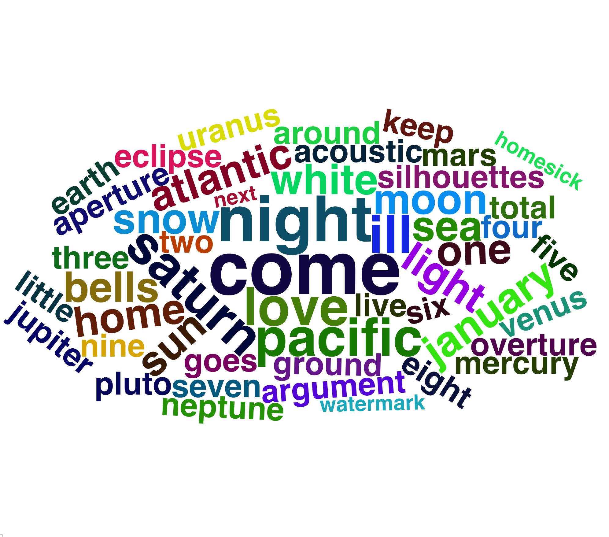

<style>
.navbar {
  background-color:indigo;
}
.navbar-inverse .navbar-nav > li > a:hover,
.navbar-inverse .navbar-nav > li > a:focus {
    background-color: midnightBlue;
    color: white;
}
.navbar-inverse .navbar-nav > .active > a,
.navbar-inverse .navbar-nav > .active > a:hover,
.navbar-inverse .navbar-nav > .active > a:focus {
  color: white;
  background-color: midnightBlue;
}
.navbar-inverse .navbar-toggle:hover,
.navbar-inverse .navbar-toggle:focus {
  background-color: midnightBlue;
}
.navbar-inverse .navbar-collapse,
.navbar-inverse .navbar-form {
  border-color: midnightBlue;
}
</style>

```{r setup, include=FALSE}
knitr::opts_chunk$set(echo = TRUE)
library(tidyverse)
library(spotifyr)
library(plotly)
library(compmus)
library(fontawesome)
library(gridExtra)
library(rpart.plot)
```

# `r fa("house-chimney")`  Introduction {.storyboard}

### Introduction

```{r corpus setup, include=FALSE}
corpus <- readRDS(file = "data/corpus.RDS")
```

My corpus is a playlist with `r nrow(corpus)` songs. To gain a little bit more insight into this playlist I created a word cloud (in the next tab, due to a bug in wordcloud I cannot put 2 word clouds on the same page. So I decided to get both of them their own tab).
What do all the songs have in common?
They are all songs I like.
It is a very diverse list with songs ranging from film music to _Shawn Mendes_ to _The Sidh_ to _Maria Mena_.
But there is one specific artist I listen to significantly more than any other artist: _Sleeping At Last_.
_Sleeping At Last_ is an artist that has all kinds of projects for himself.
For example, he makes songs about upcoming astronomical events (_Astronomy_ series), or about involuntary human development (_Atlas II_ series).
He also has a podcast on Spotify about how he makes his songs.
_Sleeping At Last_ has a thin line with film music.
His music can be heard often in films and series.
But his music also comes in contact with more popular artists: he has made some covers.
Because of these things, he is easy to compare to other songs in the playlist.
However, I am not interested in how _Sleeping At Last_ compares to the other artists, but I am interested in how he differs from the other songs in the playlist.
What makes _Sleeping At Last_ _Sleeping At Last_?
Why is this the artist I listen to most often?
Are there other artists with the same characteristics?

I also made a word cloud from the titles of all _Sleeping At Last_ songs (in one of the other tabs). I think that to get an even deeper understanding of the style of _Sleeping At Last_, there are a few songs that are most interesting to look at.
First, one or more _astronomy_ songs from _Sleeping At Last_.
These are the songs that are very typical for _Sleeping At Last_.
Both in the sense of the subject and the kind of music and instruments.
Moreover, it would be nice to look at one or more of the songs that are included in a film or TV series and compare it to another song in that film or TV series to see what is so special about this song being there.
Furthermore, one or more of his covers can be compared to the original to see how the styles differ and get to know more about this specific style of _Sleeping At Last_.

I think that _Sleeping At Last_ songs in general are more calm and also more instrumental than the other songs in the corpus. Moreover, I think that the use of specific instruments that are not used a lot in the rest of the corpus will make the songs sound different from the other songs. 

In the other tabs, analysis and information can be found about feeling, sound and tempo of _Sleeping At Last_ songs. 
The findings that were found during the analysis are summarized in the results section, where the corpus will also be tried to be divided in a decision tree according to these conclusions.

***

<iframe style="border-radius:12px" src="https://open.spotify.com/embed/playlist/3jblLN3iqoULSfQGHAFYVe?utm_source=generator" width="100%" height="352" frameBorder="0" allowfullscreen="" allow="autoplay; clipboard-write; encrypted-media; fullscreen; picture-in-picture" loading="lazy"></iframe>

### Word Cloud Corpus Songs

```{r word cloud, echo=FALSE}
word_cloud <- readRDS(file = "data/word.RDS")
word_cloud
```

### Word Cloud Sleeping At Last songs

```{r word cloud sleeping, echo=FALSE}
word_cloud2 <- readRDS(file = "data/word_sleeping.RDS")
word_cloud2
```


# `r fa("heart")`  Feeling {.storyboard}
### Valence, acousticness, danceability and instrumentalness [track-level features]

```{r track-level features plot, echo=FALSE}
track_plot <- readRDS(file = "data/track.RDS")
track_plot
```

***

In this graphic, the track-level features valence, acousticness, instrumentalness and danceability are shown for the _Sleeping At Last_ songs in the playlist compared to the other songs in the playlist.
The graphic shows that _Sleeping At Last songs_ have a higer acousticness than the other songs in general, whereas the valence and danceability tend to be lower.
In addition, the proportion of instrumental songs seems to be bigger in the _Sleeping At Last_ songs than in the other songs.

### Duration [track-level features]

```{r duration plot, echo=FALSE}
duration_plot <- readRDS(file = "data/duration.RDS")
duration_plot
```

***

In this plot it can be seen that the songs from _Sleeping At Last_ are shorter in general in comparison to the other songs in the playlist. He does not have any outliers to the right and has more shorter songs. 

# `r fa("music")`  Sound {.storyboard}
### Histogram of keys [track-level features]

```{r histogram keys, echo=FALSE}
key_plot <- readRDS(file = "data/keys.RDS")
key_plot
```

***

In this histogram it can be seen that _Sleeping At Last_ has more songs in the C and D#/Eb keys and less songs in the C#/Db, D, E, and A keys in general. In the other tabs about sound there will be looked at the chroma and timbre inside a song and what that can say about that song.


### Keygram of _June 24, 2022: Parade of Planets_ [tonal analysis]

```{r astronomy keychram, echo=FALSE}
astronomy_key <- get_track_audio_features("4kZhLfs3nsJu8JBqEXdxNW")$key
astronomy_plot <- readRDS(file = "data/astronomy.RDS")
astronomy_plot
```

***

This is a keygram from one of _Sleeping At Lasts_ astronomy songs: [_June 24, 2022: Parade of Planets_](https://open.spotify.com/track/4kZhLfs3nsJu8JBqEXdxNW?si=f5fa16753a9a4176). According to Spotify, the key in general is B. It is a song about the planetary alignment that could be observed on June 24, 2022. Seven of the planets could be seen aligned in the sky around that time. There also is a [podcast episode about this song](https://open.spotify.com/episode/2FVj0AD4PNPHee0cHS6MDr?si=f8badc32e4bb4e81) in which the artist tells that every planet has its own melody and they come together in this song. The piano, violin and cello are heard throughout the song and connect everything. 

When we take a closer look at the song, it can be seen that the song starts in B major. Then, around 100 seconds it is unclear what the key of that section is. Maybe the variety of instruments (piano, cello and violin) and melodies makes Spotify wondering what the key is. A bit after 120 seconds there is a change in key: the song changes to C# minor. This change can also be heard in the song: first a violin and a piano are playing and then the song changes to cello, piano and singing. Especially the singing makes the song sound different. Then, approximately 30 seconds later, it becomes unclear again what the keys of the sections are. We can hear the same instruments and melody as the last time this happened. This also finalizes the song.

<iframe style="border-radius:12px" src="https://open.spotify.com/embed/track/4kZhLfs3nsJu8JBqEXdxNW?utm_source=generator" width="100%" height="152" frameBorder="0" allowfullscreen="" allow="autoplay; clipboard-write; encrypted-media; fullscreen; picture-in-picture" loading="lazy"></iframe>

### Chromagram of the song _Dark Horse_ by _Sleeping At Last_ [chroma features]

```{r chroma sleeeping, echo=FALSE}
dark_horse_sleeping_plot <- readRDS(file = "data/dark_horse_sleeping_plot.RDS") 
dark_horse_sleeping_plot
```

***

In this chromagram the song [_Dark Horse_](https://open.spotify.com/track/1i5PW20LSYwCQMjVQgSXVM?si=277d1d3cab904cdd) by _Sleeping At Last_ is shown using the Chebyshev normalization metric. It can be seen that the notes B, A, F# and C# are played most often. This is not surprising, since the key of the song is in F#. 

<iframe style="border-radius:12px" src="https://open.spotify.com/embed/track/1i5PW20LSYwCQMjVQgSXVM?utm_source=generator" width="100%" height="152" frameBorder="0" allowfullscreen="" allow="autoplay; clipboard-write; encrypted-media; fullscreen; picture-in-picture" loading="lazy"></iframe>

### Chromagram of the song _Taste_ from _Sleeping At Last_ [chroma features]

```{r chroma taste, echo=FALSE}
taste_plot <- readRDS(file = "data/taste.RDS")
taste_plot
```

***

This is a chromagram of the song [_Taste_](https://open.spotify.com/track/6we2POU5MK1mpLACndFlG5?si=82c4e3b24a3246e9) from _Sleeping At Last_. The song mostly is in the D key. However, sometimes it goes to A, G#/Ab, G, F#Gb or F. The first two times, around 60 seconds and around 120 seconds, this happens when a kind of explosion can be heard in the music. The last time, from around 200 seconds, a new rhythm with different instruments can be heard.

In the next tab the structure of the song will be analysed.

<iframe style="border-radius:12px" src="https://open.spotify.com/embed/track/6we2POU5MK1mpLACndFlG5?utm_source=generator" width="100%" height="152" frameBorder="0" allowfullscreen="" allow="autoplay; clipboard-write; encrypted-media; fullscreen; picture-in-picture" loading="lazy"></iframe>

### Structure of the song _Taste_ from _Sleeping At Last_ [chroma and timbre features] {data-commentary-width=450}

```{r self sim, echo=FALSE}
taste2_plot <- readRDS(file = "data/taste2.RDS")
taste2_plot
```

***

The two self-similarity matrices illustrate pitch- (chroma) and timbre-based self-similarity within the song [_Taste_](https://open.spotify.com/track/6we2POU5MK1mpLACndFlG5?si=82c4e3b24a3246e9) from _Sleeping At Last_. The song is instrumental so no clear parallel diagonal lines are seen in both graphs. However, a clear structure can be seen. The different parts from both graphs can be seen in the table below.

At the start of the song, a little melody can be heard which continues throughout the whole song. Multiple instruments join this melody. Around 23 seconds the piano comes in and the music starts to be louder. This can be seen in both chroma and timbre graphs. Then, around 45 seconds, some background singing can be heard which leads to a kind of 'explosion' which happens around 49 seconds. This can be seen in the chroma graph. Around 72 seconds the music settles down again which can be seen in both graphs. Around 80 seconds drums are introduced which can be seen in the chroma graph. 4 seconds later a flute can be heard which becomes increasingly louder until the rhythm of the music increases around 88 and guitars can be heard clearly (seen in the timbre graph). Until 148 seconds some previous parts repeat itself, but no clear difference can be seen. However, at 148 seconds the music settles down again and continues slowly (seen in both graphs). Some background singing starts and at the start of the third minute some tension builds up until around 188 seconds, where a new rhythm starts with different instruments (seen in both graphs). At 215 seconds the music continues with some background singing and some flute whistling (seen in the timbre graph) until it reaches 251 seconds. At this point, the music settles down until it fades away at 259 seconds (seen in both graphs).

When the music instruments change, it can be seen that the timbre graph changes. We can see some instrument groups reappearing throughout the music. This can also be heard. You hear a flute and some background music coming and going throughout the song. But also the starting instruments are coming back in the song. However, if there is only a change in melody and not in instruments, we can see the chroma graph changing. This is the case, for example, after one of the 'explosions' you can hear in the song. If the melody as well as the music instruments change, this is shown in both graphs.

<iframe style="border-radius:12px" src="https://open.spotify.com/embed/track/6we2POU5MK1mpLACndFlG5?utm_source=generator" width="100%" height="152" frameBorder="0" allowfullscreen="" allow="autoplay; clipboard-write; encrypted-media; fullscreen; picture-in-picture" loading="lazy"></iframe>

# Tempo {.storyboard data-icon="fa-stopwatch"}
### Histogram of tempi [track-level features]

```{r tempo histogram, echo=FALSE}
tempo_plot <- readRDS(file = "data/tempo.RDS")
tempo_plot
```

***

In this histogram it can be seen that _Sleeping At Last_ has more songs with a tempo lower than 80 and with a tempo between 120 and 160 in general when comparing it with the other songs in the playlist. In other tabs about tempo there will be looked at the tempo within a song and what this can say about that song.

### Tempogram of the Atom series [temporal features]

```{r atom tempogram, echo=FALSE}
atom1_plot <- readRDS(file = "data/atom1.RDS")
atom2_plot <- readRDS(file = "data/atom2.RDS")
atom3_plot <- readRDS(file = "data/atom3.RDS")
atom4_plot <- readRDS(file = "data/atom4.RDS")
atom5_plot <- readRDS(file = "data/atom5.RDS")
atom6_plot <- readRDS(file = "data/atom6.RDS")
atom7_plot <- readRDS(file = "data/atom7.RDS")
atom8_plot <- readRDS(file = "data/atom8.RDS")
atom9_plot <- readRDS(file = "data/atom9.RDS")

atoms_plot <- grid.arrange(atom1_plot, atom2_plot, atom3_plot, atom4_plot, atom5_plot, atom6_plot, atom7_plot, atom8_plot, atom9_plot, nrow=3)
atoms_plot
```

***

In the _Atoms_ series, _Sleeping At Last_ tries to catch small interesting events and turns them in a song of approximately one minute. For more information about this series, there is a podcast [here](https://open.spotify.com/episode/6OZiHVUheBuPuO5vwyZ6Pe?si=4db17a2cab27437a)

In [_Atom 1_](https://open.spotify.com/track/0NyBxQlgLlq6YgGEuDKekc?si=4689e7870942468d), we hear a lof of different sounds coming together. It can be heard that the tempo is certainly not constant. This can also be seen in the tempogram.

In [_Atom 2_](https://open.spotify.com/track/47kqm43MxG45HEdGVudXxK?si=29a42ef496574532), a melody that is constant in tempo can be heard in the first sixteen seconds. This can also be seen in the tempogram: there is a horizontal line at 400 BPM. After this singing comes in. After each sentence, there is a little instrumental part again, which can also be found in the tempogram. This are the little horizontal lines on that same 400 BPM. The singing can also be found in the tempogram, but at a bit higher level and is not as constant as the instrumental parts.

In [_Atom 3_](https://open.spotify.com/track/5rlcAcJfUzssBjfZryvmRS?si=10291afe8e624fb0), [_Atom 4_](https://open.spotify.com/track/3OQumqHQWrrRmCMlONe51e?si=b644694d71494aae) and [_Atom 8_](https://open.spotify.com/track/3HOe1ZIcGx29Q8SGaYmDH2?si=7abccab38a764efc), a melody is heard that repeats itself multiple times. This melody slows down and accelerates a bit, but is approximately the same tempo. This can be seen in the tempograms by the 'curly' horizontal lines. 

In [_Atom 5_](https://open.spotify.com/track/3zjpAA7IC5Hfm9hvBad86i?si=a18695dd72f942cc), in the first 5 to 20 seconds we can hear a violin playing. The violin plays with a constant tempo: there is a clear horizontal line in the tempogram. However, after twenty seconds, a cello starts playing and the tempo becomes irregular.

In [_Atom 6_](https://open.spotify.com/track/4Hctp8jfbMwLTchI6o3vDc?si=cd054ed55e8a4a76), the first 40 seconds are a bit unclear concearning tempo. However, around 40 seconds a flute and a piano can be heard. Those two instruments have a clear very clear tempo, wich can also be seen by the horizontal line that starts around that time. This stays untill the end of the song. 

In [_Atom 7_](https://open.spotify.com/track/3KD3qVfZd6C7ERAaCYkhTn?si=42f4ad0e3db54d39) and [_Atom 9_](https://open.spotify.com/track/2flsa9qZKC4j6oAKwoBZc0?si=8da2c233aa4a48ef), a clear melody can be heard throughout the whole song. Around this melody, the rest of the song is made. The melody has a clear tempo which can also be seen in the tempograms. 

### Tempogram of _Hearing_ [temporal features]

```{r hearing tempogram, echo=FALSE}
hearing_plot <- readRDS(file = "data/hearing_cyclic.RDS")
hearing_plot
```

***

The song [_Hearing_](https://open.spotify.com/track/1pUcIyiiqJFmDCxqFMR7xx?si=63508f3df6da42fd) is part of _Sleeping At Lasts_ Atlas series. This series is based on he origins of the universe and the life within it.

In the song there is a melody that repeats itself the whole song. However, this melody does not have a constant tempo. The tempo calculated by Spotify probably listens to the stringed instruments. Around 160 seconds until a bit after 180 seconds, the string instruments deviate from the melody which can be seen in the tempogram. 

<iframe style="border-radius:12px" src="https://open.spotify.com/embed/track/1pUcIyiiqJFmDCxqFMR7xx?utm_source=generator" width="100%" height="152" frameBorder="0" allowfullscreen="" allow="autoplay; clipboard-write; encrypted-media; fullscreen; picture-in-picture" loading="lazy"></iframe>

### Tempogram _Everything she does is magic_ by _Sleeping At Last_

```{r}
magic_plot <- readRDS(file = "data/magic_cyclic.RDS")
magic_plot
```

***

In the song [_Everything she does is magic_](https://open.spotify.com/track/3cBtANnJGopPaRMXCl3mV7?si=cb41d595eaf44dba) from _Sleeping At Last_, we can see the tempo stays mostly at a constant tempo. This is probably because of the piano in the background which plays at the same tempo a lot.

<iframe style="border-radius:12px" src="https://open.spotify.com/embed/track/3cBtANnJGopPaRMXCl3mV7?utm_source=generator" width="100%" height="152" frameBorder="0" allowfullscreen="" allow="autoplay; clipboard-write; encrypted-media; fullscreen; picture-in-picture" loading="lazy"></iframe>

### Differences in tempo of the song _Dark Horse_ by _Katy Perry_ and _Sleeping At Last_ [chroma features]

```{r dynamic time warping plot, echo=FALSE}
dark_horse_plot <- readRDS(file = "data/dark_horse.RDS")
dark_horse_plot
```

***

In this plot the tempo differences between [_Katy Perry_](https://open.spotify.com/track/5jrdCoLpJSvHHorevXBATy?si=d72d550d8e4a4622) and [_Sleeping At Last_](https://open.spotify.com/track/1i5PW20LSYwCQMjVQgSXVM?si=21c94ad8be8d4432) are shown for the song _Dark Horse_. The more yellow we see, the more different the tempo in the two songs is. 
It can be seen that, although there are some points in the song where both artists have the same tempo, _Katy Perry's_ tempo is a bit faster in general.
At the end of the song, _Sleeping At Last_ deviates from the original song by skipping over the bridge (starting with "Uh, she's a beast") and repeating 'There's no going back' multiple times.

<iframe style="border-radius:12px" src="https://open.spotify.com/embed/track/5jrdCoLpJSvHHorevXBATy?utm_source=generator" width="100%" height="152" frameBorder="0" allowfullscreen="" allow="autoplay; clipboard-write; encrypted-media; fullscreen; picture-in-picture" loading="lazy"></iframe>

<iframe style="border-radius:12px" src="https://open.spotify.com/embed/track/1i5PW20LSYwCQMjVQgSXVM?utm_source=generator" width="100%" height="152" frameBorder="0" allowfullscreen="" allow="autoplay; clipboard-write; encrypted-media; fullscreen; picture-in-picture" loading="lazy"></iframe>

# `r fa("magnifying-glass")`  Results{.storyboard}

### Feeling, sound and tempo

**Feeling**

Compared with the other song in the corpus, _Sleeping At Last_ makes songs that have a higher acousticness, but lower valence and danceability in general. Moreover, in proportion, he makes more instrumental songs. The songs in general are also shorter. This is in agreement with the hypothesis that _Sleeping At Last_ songs are more calm and instrumental.


**Sound**

When looking at the sound of the song from _Sleeping At Last_, we saw that the instruments that are used a lot are the piano, the violin, the cello and singing. This gives the songs a certain vibe which I think is very specific to _Sleeping At Last_.


**Tempo**

Lastly, we saw that _Sleeping At Last_ does not have many regular tempo songs: most songs are either slow or fast. When taking a closer look, we could see that is often was not clear which tempo the song had. This probably has to do with the instruments that are used and how the Spotify algorithm works. 

### Decision Tree
```{r decision tree, echo=FALSE}
tree <- readRDS(file = "data/tree.RDS")
colors <- readRDS(file = "data/colors.RDS")
accuracy <- readRDS(file = "data/accuracy.RDS")
rpart.plot(tree, type=5, fallen.leaves = TRUE, box.palette = c(colors[2], colors[6]), )
```

***

To see if we can divide the corpus into _Sleeping At Last_ songs and other songs, a decision tree was made. The tree took into account: danceability, valence, acousticness, instrumentalness, tempo and key. The decision tree was trained on 90% of the data and tested with the other 10%. On the 10%, it had an accuracy of `r accuracy`. The tree was prepruned to have a maximum depth of 5 and a minimum split of 10.

The desision tree supports the claims that were made in the results: _Sleeping At Last_ songs have a high acousticness and a high instrumentalness.

# `r fa("star")`  Extra {.storyboard}

### Tempgram of _Opus_

```{r opus tempogram, echo=FALSE}
opus_plot <- readRDS(file = "data/opus.RDS")
opus_plot
```

***

In the song [_Opus_](https://open.spotify.com/track/3v2oAQomhOcYCPPHafS3KV?si=31511facd0814140) from _Eric Prydz_ there is a beat building up until approximately three minutes. Then, it stays constant. Around 3:40, 4:50, 5:40, and 6:20 it feels like the beat is falling again, but this is not the case untill it does around 6:40. This can all be seen in the tempogram. There are also a lot of suboctaves that can be seen. 
